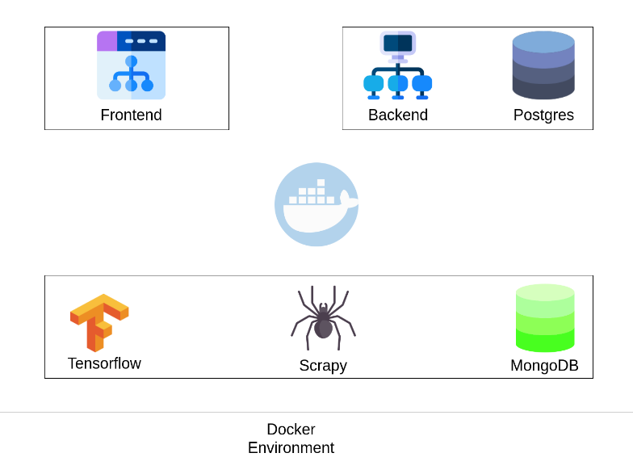

# MindMiner

<!---Esses são exemplos. Veja https://shields.io para outras pessoas ou para personalizar este conjunto de escudos. Você pode querer incluir dependências, status do projeto e informações de licença aqui--->


<p align="center">
    
</p>

> Mindminer é um trabalho de conclusão de curso que visa a utilização das principais tecnologias para melhorar a percepção de grandes quantidades de dados e seus diversos nichos dentro do Twitter.

## 💡 Arquitetura

<p align="center">
    
</p>
## 💻 Pré-requisitos

Antes de começar, verifique se você atendeu aos seguintes requisitos:
* Instalação do `docker` e `docker-compose`.
* Arquivos de secrets contendo token de autenticação do Twitter e APINews.
* Processador com intrução AVX (Necessário para classificação com Tensorflow.)

## 🚀 Instalando Mindminer

Para instalar o Mindminer, basta executar:

```
docker-compose up
```

## ☕ Usando o Mindminer

Para usar o Mindminer, basta acessar:

```
0.0.0.0:80 (Frontend)
0.0.0.0:8000 (Painel de administração do Django)
```

## 📫 Contribuindo para o Mindminer
Para contribuir, siga estas etapas:

1. Bifurque este repositório.
2. Crie um branch: `git checkout -b <nome_branch>`.
3. Faça suas alterações e confirme-as: `git commit -m '<mensagem_commit>'`
4. Envie para o branch original: `git push origin <nome_do_projeto> / <local>`
5. Crie a solicitação de pull.

Como alternativa, consulte a documentação do GitHub em [como criar uma solicitação pull](https://help.github.com/en/github/collaborating-with-issues-and-pull-requests/creating-a-pull-request).

## 🤝 Colaboradores

Principais contribuidores:

<table>
  <tr>
    <td align="center">
      <a href="https://github.com/JulianPedro">
        <br>
        <sub>
          <b>Julian Pedro</b>
        </sub>
      </a>
    </td>
    <td align="center">
      <a href="#">
        <br>
        <sub>
          <b>Rauan</b>
        </sub>
      </a>
    </td>
  </tr>
</table>

[⬆ Voltar ao topo](#nome-do-projeto)<br>
